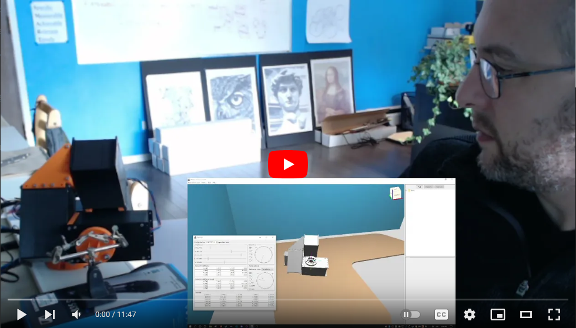

# Robot Overlord #

Robot Overlord is 3D control software for robots.  It is intended to be easier than ROS.  It was started by [Marginally Clever Robots, Ltd.](http://www.marginallyclever.com/)

We would love to see your robot run in the app.  Please joint our [Discord channel](https://discord.gg/Q5TZFmB) and talk live with a human!  

Some of the robots it controls are:

 - Sixi 2+3, 6DOF arms
 - Arm3, a 3DOF arm
 - Thor, a 5DOF arm
 - Rotary Stewart Platforms, like flight simulators
 - Delta Robot 3, aka a Kossel
 - Spidee, a 6 legged crab-style walker.
 - Dog Robot, a generic 4 legged walker.

# Video

# Why

[Our philosophy about Robot Overlord](https://github.com/MarginallyClever/Robot-Overlord-App/wiki/Why-Robot-Overlord%3F).

## Get Started!

Steps to get started:

1. Install The latest Java
2. Install Robot Overlord App from [the "Releases" section of the Github repository](https://github.com/MarginallyClever/Robot-Overlord-App/releases)

Then you should be able to run the application.

## Usage

Camera movement: middle mouse button.  Click and drag to move forward and back.  shift+drag to orbit.  roll the middle mouse to change the orbit distance.  

Double click any entity in the entityManager to select it, or use the entity panel in the top right.

For robot arms, select an arm and then open the control panel.

## More

If you're reading this, make an issue ticket and we will respond to it promptly.

