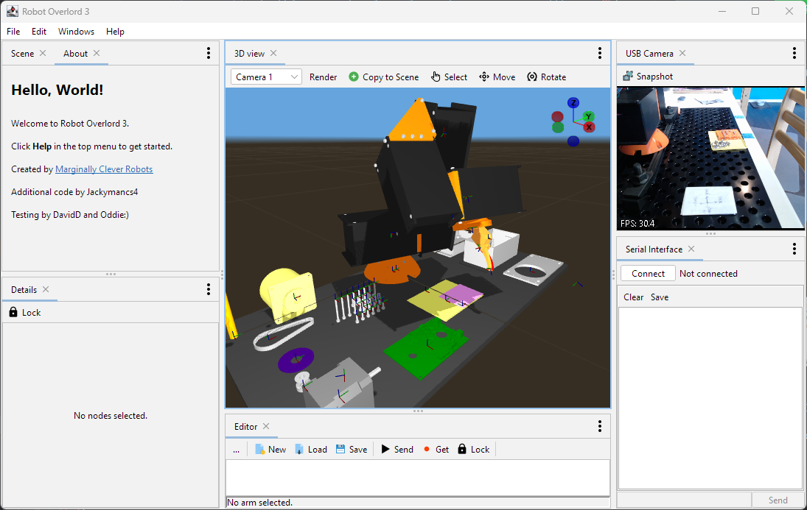

# Robot Overlord

Robot Overlord is an open-source 3D interface for simulating and controlling robots through a node-based visual programming system. Think of it as a lightweight, easier-to-use alternative to ROS, with a built-in 3D engine and real-time feedback.

Whether you're controlling DIY robots or developing custom simulations, Robot Overlord provides a visual, modular approach that makes robotics more accessible for makers, educators, and hobbyists.

## ✨ Features

🧩 Visual Programming: Create complex robot behaviors using a node graph system.

🤖 Hardware Control: Supports live control of DIY robots via serial or network communication.

🌐 3D Simulation: Preview and test robot kinematics in a built-in OpenGL scene.

📐 Multiple Robot Types:

- 5/6 DOF arms: like [AR4](https://www.anninrobotics.com/) and [Meca500](https://mecademic.com/products/meca500-industrial-robot-arm/)
- Stewart Platforms (flight simulators)
- Bipeds, quadrupeds, hexapods
- Custom DIY solutions easily extensible in Java
        
## Quickstart

Download the latest release (coming soon).

Follow the [Getting Started Guide](https://mcr.dozuki.com/c/Robot_Overlord_3) to set up your robot.

Launch the app and start building your graph!

## Screenshots

## Why

The short answer?  ROS is too hard.  We want to make it easier.

[Our philosophy about Robot Overlord](https://github.com/MarginallyClever/Robot-Overlord-App/wiki/Why-Robot-Overlord%3F).

## 🤝 Get Involved

We would love to see your robot running in Robot Overlord

🗣️ [Join our Discord](https://discord.gg/Q5TZFmB)

🛠️ Fork this repo and share your improvements!

🧠 Submit ideas and feature requests in (Issues)[https://github.com/MarginallyClever/Robot-Overlord-App/issues]

## Credits

- app icons provided by http://icons8.com.
- Developed by [Marginally Clever Robots, Ltd.](http://www.marginallyclever.com/).

