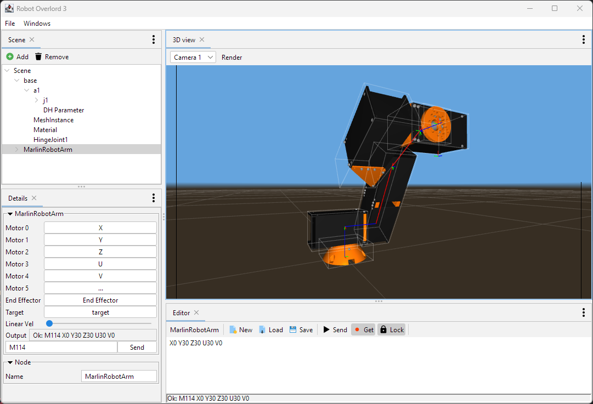

# Robot Overlord #

Robot Overlord is 3D control software for robots.  It is intended to be easier than ROS.  It was started by [Marginally Clever Robots, Ltd.](http://www.marginallyclever.com/)

We would love to see your robot run in the app.  Please joint our [Discord channel](https://discord.gg/Q5TZFmB) and talk live with a human!  

Some of the robots it controls are:

 - Sixi 2+3, 6DOF arms
 - Arm3, a 3DOF arm
 - Thor, a 5DOF arm
 - Rotary Stewart Platforms, like flight simulators
 - Delta Robot 3, aka a Kossel
 - Spidee, a 6 legged crab-style walker.
 - Dog Robot, a generic 4 legged walker.

# Why

The short answer?  ROS is too hard for most people.  We want to make it easier.

[Our philosophy about Robot Overlord](https://github.com/MarginallyClever/Robot-Overlord-App/wiki/Why-Robot-Overlord%3F).

## Get Started!

Steps to get started:

1. Install The latest Java
2. Install Robot Overlord App from [the "Releases" section of the Github repository](https://github.com/MarginallyClever/Robot-Overlord-App/releases)

Then you should be able to run the application.

## More

If you're reading this, make an issue ticket, and we will respond to it promptly.

## Icons

Many app icons provided by http://icons8.com.