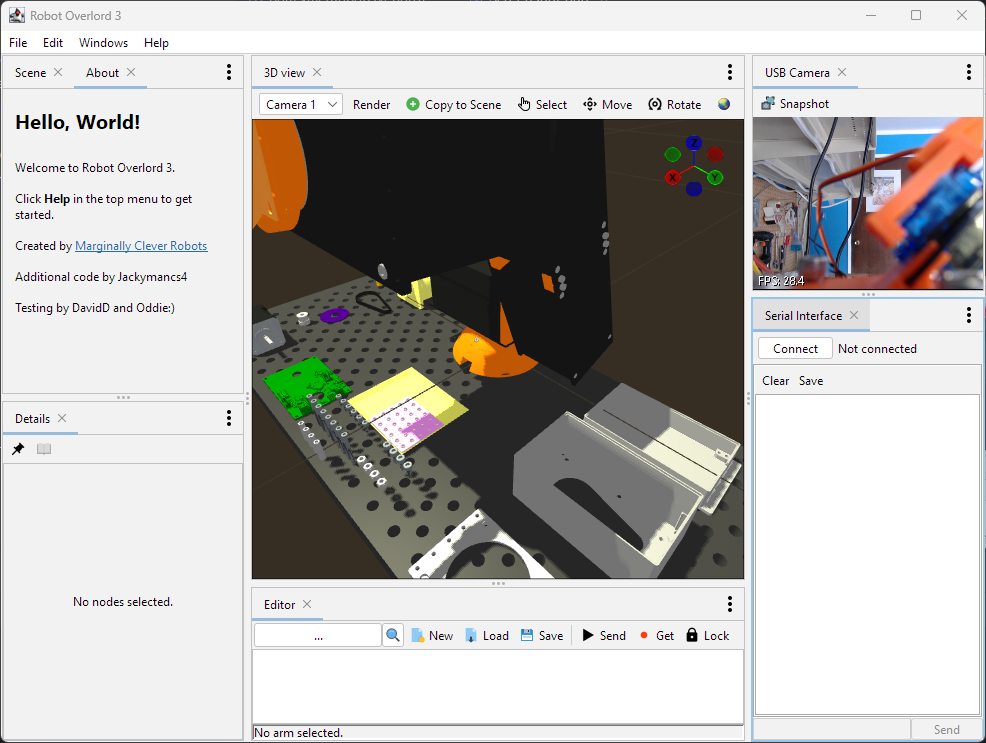

# Robot Overlord

Robot Overlord is 3D control software for robots.  It is intended to be easier than ROS.  It was started by [Marginally Clever Robots, Ltd.](http://www.marginallyclever.com/)

We would love to see your robot run in the app.  Please joint our [Discord channel](https://discord.gg/Q5TZFmB) and talk live with a human!  

Some of the robots it controls are:

- Sixi 3, AR4, Mecademic Meca500, and other 6DOF arms
- Rotary Stewart Platforms, like flight simulators
- Dog robots.
- Spidee, a 6 legged crab-style walker.

## Why

The short answer?  ROS is too hard.  We want to make it easier.

[Our philosophy about Robot Overlord](https://github.com/MarginallyClever/Robot-Overlord-App/wiki/Why-Robot-Overlord%3F).

## Get Started today!

[Read our friendly manual](https://mcr.dozuki.com/c/Robot_Overlord_3).  It has pictures with arrows and everything!

## Icons

Many app icons provided by http://icons8.com.